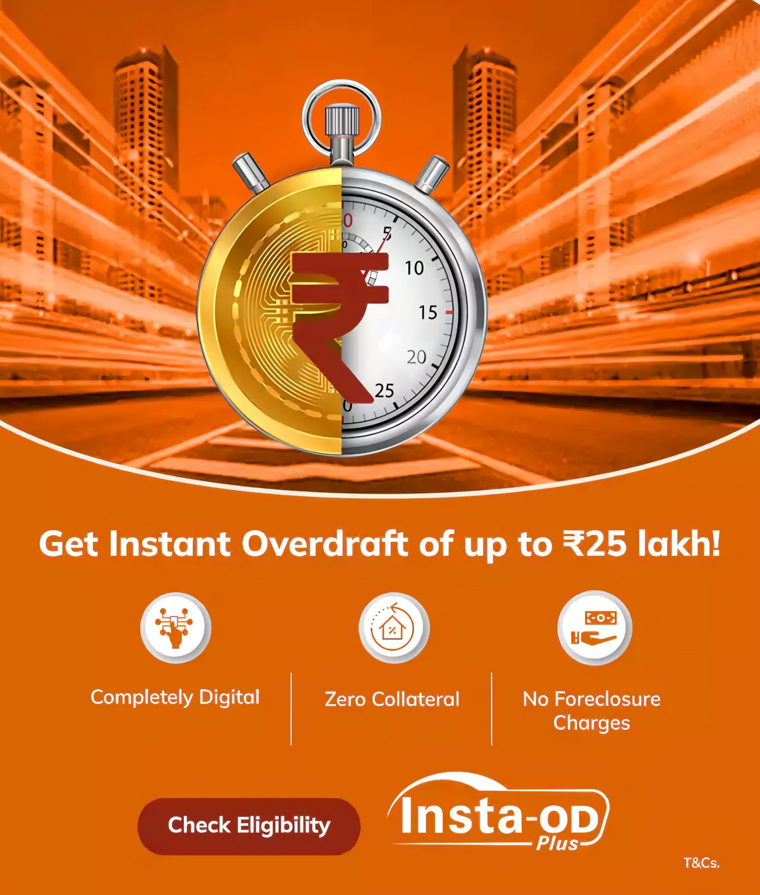

# ICICI Bank Node.js Web Application

A professional-grade Node.js-based simulation of ICICI Bank’s digital banking portal. This platform includes secure authentication, dynamic navigation, modern UI components, and backend automation using MySQL and Express. Designed for extensibility, it can easily integrate AI-based insights, OCR-based data input, and analytics services in future iterations.

---

## Table of Contents

1. Overview
2. Features
3. Technologies Used
4. Installation
5. Usage
6. Project Structure
7. Environment Configuration
8. Database Setup
9. Image Asset Usage
10. UI Styling Overview
11. AI & Automation Opportunities
12. License

---

## 1. Overview

This project replicates ICICI Bank’s online service portal using a scalable Node.js stack. It features a secure login system, session-based dashboard redirection, dynamic form interfaces, and mobile-optimized styling. Built with modularity in mind, the system enables easy extension into AI-enhanced decision logic or financial analytics integration.

---

## 2. Features

- Session-based login and access protection
- Auto-generated user table (MySQL)
- QR code structure prepared for secure registration or scanning
- Nodemailer-ready for transactional email support
- Slideshow banners and visual redirection
- Responsive design with Bootstrap + custom CSS enhancements
- Styled payment forms and multi-service navigation

---

## 3. Technologies Used

| Layer      | Libraries / Tools                                |
|------------|--------------------------------------------------|
| Frontend   | HTML5, CSS3, Bootstrap 5, Responsive Media Queries |
| Backend    | Node.js, Express, dotenv, express-session         |
| Database   | MySQL, MySQL2                                     |
| Tools      | body-parser, cors, nodemailer, qrcode, uuid       |
| Automation | DB auto-sync, login session expiry, dynamic routing |

---

## 4. Installation

```bash
git clone https://github.com/kush1310/icici-bank-node.js.git
cd icici-bank-node.js
npm install
```

---

## 5. Usage

```bash
npm start
```

Then open in your browser:

```
http://localhost:3000
```

---

## 6. Project Structure

```
.
├── server.js
├── package.json
├── .env
├── images/                    # Image assets (UI, banners, logos)
├── *.html                     # UI pages (login, signup, services)
├── redirect.css               # Custom CSS styling
```

---

## 7. Environment Configuration

Create a `.env` file:

```
PORT=3000
SESSION_SECRET=your_secret_here
```

---

## 8. Database Setup

Create and configure MySQL:

```sql
CREATE DATABASE iciciBank;
```

On startup, the system ensures this table exists:

```sql
CREATE TABLE Users (
  id INT AUTO_INCREMENT PRIMARY KEY,
  username VARCHAR(255) NOT NULL,
  password VARCHAR(255) NOT NULL,
  email VARCHAR(255) NOT NULL,
  phone VARCHAR(255) NOT NULL,
  qrCode TEXT NOT NULL
);
```

---

## 9. Image Asset Usage

Images are stored in the `images/` directory and can be referenced in HTML like:

```html


```

This folder includes:

- Marketing and loan banners
- ICICI brand assets and store logos
- Backgrounds for UI sections

---

## 10. UI Styling Overview

Custom CSS (`redirect.css`) is applied for brand consistency:

- Button hover transitions
- Slide shows with `setTimeout` logic
- Section layout using `flexbox` and Bootstrap grid
- Custom breakpoints for tablets and mobile devices

Example snippet:

```css
.section-highlight {
    padding: 40px 20px;
    background: linear-gradient(to right, #f3f4f6, #ffffff);
    border-radius: 8px;
    transition: all 0.3s ease-in-out;
}
```

---

## 11. AI & Automation Opportunities

While this version is primarily UI/UX and backend driven, the structure allows for:

- OCR integration for document uploads
- AI chat assistant for user queries (e.g. financial tips)
- Fraud detection using behavioral pattern analysis (future scope)
- Analytics dashboards using historical usage data

Hooks for these enhancements can be introduced at service endpoints and the dashboard UI.

---

## 12. License

This project is licensed under the [ISC License](https://opensource.org/licenses/ISC). All product names, logos, and brands are property of their respective owners.
